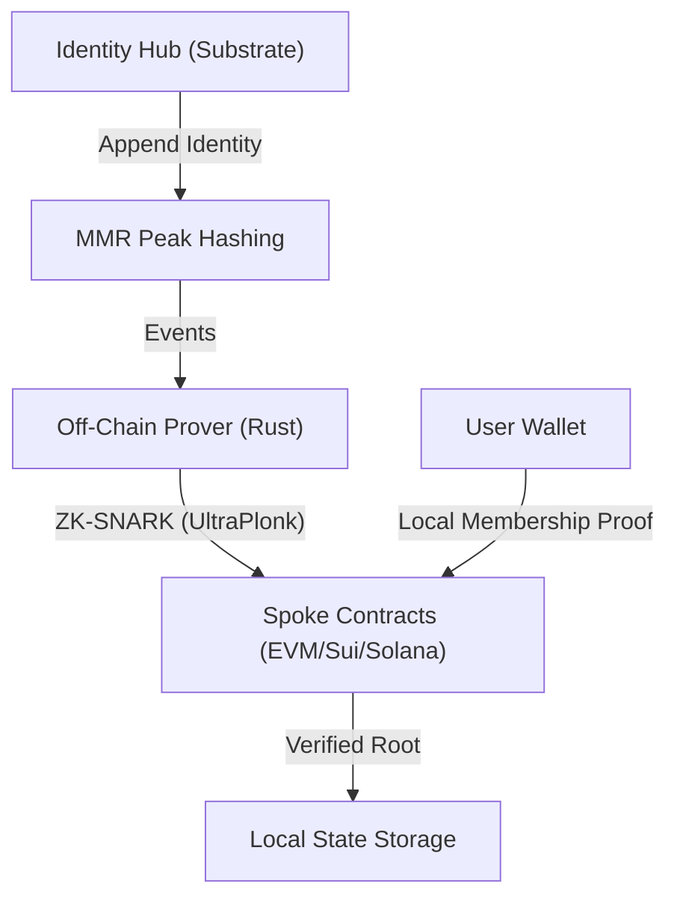

# Project: PortableID Cross-Chain Identity Bridge

**Project Status:** Architectural Specification

**Core Architecture:** Hub-and-Spoke (ZK-Credential Attestation)

**Target Ecosystems:** Polkadot (Hub), Ethereum, Sui, Stacks, Solana (Spokes)

--- 

## 1. Executive Summary

PortableID is a specialized interoperability protocol designed to bridge **identity, not assets**. It allows organizations to issue Verifiable Credentials (VCs) on a secure Polkadot Parachain (the Hub) and enables users to prove those credentials on heterogeneous blockchains (the Spokes) without revealing sensitive data, using Zero-Knowledge Proofs (ZKPs).

## 2. Technical Architecture: How it Works

The PortableID bridge operates on a **ZK-Light Client** architecture, ensuring that no central party or multi-sig quorum can compromise identity integrity.

### 2.1 The Core Components



### 2.2 The Technical Workflow

1.  **Identity Registry (The Hub):** When an issuer registers an identity, the `pallet-identity-bridge` hashes the metadata and appends it to a **Merkle Mountain Range (MMR)**. This structure is chosen for its efficient append-only properties and O(log n) inclusion proofs.
2.  **State Observation:** The **Off-Chain Prover** service monitors the Hub for Polkadot finality (GRANDPA). Once a block is finalized, it extracts the MMR state transitions.
3.  **ZK-Proof Generation:** Using **Noir**, the Prover generates a ZK-SNARK that proves the state transition: * "I have a valid sequence of headers that results in MMR Root B starting from MMR Root A."*
4.  **Trustless Relay:** The Prover submits this proof to the **Spoke Contracts**. The contracts verify the proof using native crypto primitives and update their internal `latestStateRoot`.
5.  **Private Verification:** When a user interacts with a dApp, they provide a **Zero-Knowledge Membership Proof** generated locally in their wallet. The Spoke contract verifies this proof against the trusted root without ever seeing the raw DID or personal data.

---

### 2.3 The Hub: Identity Parachain (Substrate)

The Hub serves as the "Global Registry of Truth." Built with the **Substrate SDK**, it uses a custom `pallet-identity-bridge` to manage the Merkle Root of all issued DIDs and VCs.

* **State Machine:** Maintains a **Merkle Mountain Range (MMR)** of all active identity attestations.
* **Security:** Inherits Shared Security from the Polkadot Relay Chain.
* **Finality:** Uses **GRANDPA** finality to ensure identity roots are immutable before being relayed.

### 2.4 The Spokes: Smart Contract Verifiers

Each target chain hosts a "Spoke" contract that acts as a local cache for the Hub’s state.

| Chain | Environment | Storage Object | Verification Logic |
| --- | --- | --- | --- |
| **Ethereum** | EVM (Solidity) | `bytes32 latestRoot` | Groth16 Snark Verifier (Pairing-friendly) |
| **Sui** | Move | `BridgeStore` Object | `sui::zklogin_verifier` / Custom Move ZK |
| **Solana** | Anchor (Rust) | `AccountData` | Parallelized `ed25519` Sig Verification |
| **Stacks** | Clarity | `data-var root` | Clarity-based Merkle Verification |

### 2.5 The Transport: Decentralized ZK-Prover & Relayer (Rust)

A trustless network of provers and relayers maintains the bridge without requiring an m-of-n quorum.

*   **Observer:** Monitors the Parachain for state transitions and GRANDPA finality.
*   **Prover:** Generates a **ZK-Light Client Proof** (e.g., via Succinct or Aligned) that proves the validity of the new State Root based on Polkadot’s consensus.
*   **Relayer:** Submits the ZK-Proof and the new Root to the Spoke contracts.

---

## 3. Workflow Specification

### Phase A: Issuance (On-Chain Hub)

1. **Issuer** (e.g., a University) signs a VC for a **User**.
2. The **Identity Pallet** on the Parachain updates the global Merkle Tree.
3. The new **Merkle Root ()** is emitted in a block event.

### Phase B: State Relay (Trustless Bridge)

1. The **Prover** generates a ZK-SNARK proving the Parachain state transition from block to .
2. The **Relayer** submits the proof to the `update_root(R_{new}, proof)` function on Spoke contracts.
3. Spoke contracts verify the ZK-proof against the previously stored . If valid, is updated.

### Phase C: Verification (Cross-Chain Proof)

1. A **User** wants to access a dApp on Solana using their Parachain identity.
1.  A **User** wants to access a dApp on Solana using their Parachain identity.
2.  The User generates a **zk-SNARK proof** locally in their wallet.
3.  The Solana dApp calls the **Solana Spoke Contract**, passing the ZK-proof.
4.  The Spoke verifies the proof against the locally stored . Access is granted.

---

### 4.3 Issuer & Schema Governance

To maintain the integrity of the Identity Hub, PortableID implements two specialized registries:
*   **Issuer Registry:** Only whitelisted entities (e.g., Governments, Universities) can call `issue_identity`.
*   **Schema Registry:** All Verifiable Credentials must match a hashed schema registered on-chain, preventing malformed or malicious identity data.

---

## 5. Security & Economic Model

### 5.1 Zero-Knowledge Privacy
Identity data never leaves the user’s device or the Hub in plaintext. Only cryptographic hashes and proofs are transmitted.

### 5.2 ZK-Light Client Verification
Security is guaranteed by math. Spoke contracts verify GRANDPA finality and MMR roots without trusting a relayer quorum.

### 5.3 Economic Security (Fees)
Issuers pay a **Minting Fee** in the Hub's native token for every identity registered. These fees are used to:
1.  **Fund the Relayer Pool:** Compensating provers for the high O(n) cost of ZK-Proof generation.
2.  **Prevent Spam:** Making DID creation Sybil-resistant.

---

## 6. Development Roadmap

```
| Milestone | Deliverables |
| --- | --- |
| **M1: Hub Genesis** | Substrate Parachain with `pallet-identity-bridge` + Zombienet tests. |
| **M2: ZK-Circuits** | Circom/Noir circuits for membership proofs and credential validation. |
| **M3: Spoke Deployment** | Solidity, Move, and Rust contracts deployed to Testnets. |
| **M4: Relayer V1** | Rust-based service with multi-chain signing support. |
```
---
